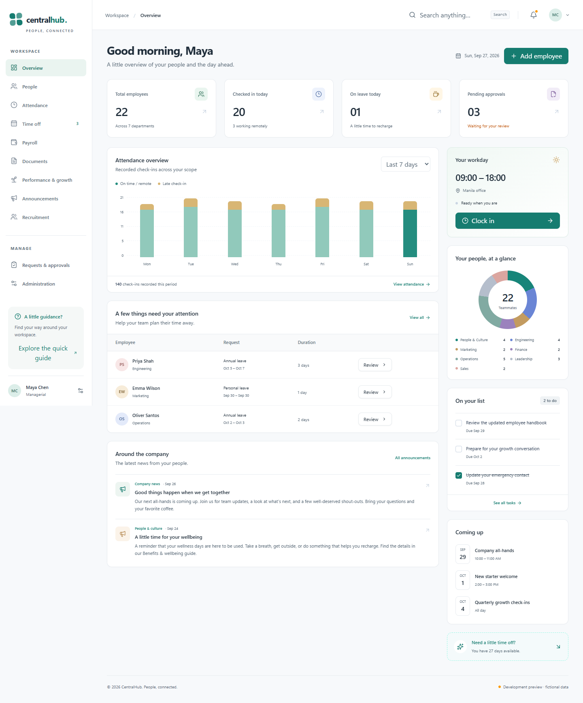

# CentralHub HRIS

A calm, responsive home for people operations, built with **Next.js, TypeScript, Tailwind CSS, shadcn/ui conventions, and Supabase**.

The application source lives in this GitHub repository. Supabase supplies PostgreSQL, Auth, MFA, and private Storage. Deploy the Next.js application to a Node-compatible host when you are ready to connect the backend. GitHub Pages cannot run its authenticated server routes.



[View the mobile interface](docs/screenshots/overview-mobile.png). Screenshots show fictional development data.

## Deploy from GitHub without a local build

CentralHub can run entirely on **Vercel + Supabase**. Vercel installs dependencies and builds the website in the cloud; your computer does not need to run a development server.

**Already deployed and applied the SQL? Follow the [browser-based Supabase setup guide](docs/HOSTED_SETUP.md).** It walks through Auth settings, first-administrator creation in the Supabase dashboard, MFA, and email delivery. No local installation or `.env.local` is needed for that path.

- Website: [centralhub-hris.vercel.app](https://centralhub-hris.vercel.app)
- Hosting settings: [CentralHub on Vercel](https://vercel.com/afhinzzailes-9029s-projects/centralhub-hris)
- Source: [pelailes-cmd/centralhub-hris](https://github.com/pelailes-cmd/centralhub-hris)

For a new deployment:

1. Open [Vercel](https://vercel.com/new), connect your GitHub account, and grant the Vercel GitHub app access to this repository. A GitHub login connection and repository permission are separate settings.
2. Import the repository. Select **Next.js**, keep the root directory at the repository root, use **Node.js 24.x**, and keep the default install and build commands. Click **Deploy**.
3. A deployment without Supabase credentials shows the setup page. Open the Vercel project's **Settings → Environment Variables** and add the following for **Production**:

   | Variable                               | Value                                                        |
   | -------------------------------------- | ------------------------------------------------------------ |
   | `NEXT_PUBLIC_SUPABASE_URL`             | Your hosted Supabase project URL                             |
   | `NEXT_PUBLIC_SUPABASE_PUBLISHABLE_KEY` | Your project's publishable key                               |
   | `SUPABASE_SERVICE_ROLE_KEY`            | Your private server-side service-role key; mark it sensitive |
   | `NEXT_PUBLIC_SITE_URL`                 | Your stable HTTPS website address, without a trailing slash  |
   | `AUTH_RATE_LIMIT_PEPPER`               | A random secret of at least 32 characters; mark it sensitive |
   | `ENABLE_DEMO`                          | `false`                                                      |
   | `ALLOW_DEVELOPMENT_SEED`               | `false`                                                      |

4. In Supabase **Authentication → URL Configuration**, set **Site URL** to your HTTPS website address and add that address followed by `/auth/confirm` to **Redirect URLs**. For this deployment, use `https://centralhub-hris.vercel.app` and `https://centralhub-hris.vercel.app/auth/confirm`.
5. Complete the [hosted Auth, administrator, MFA, and email steps](docs/HOSTED_SETUP.md). Applying SQL creates the database schema; it does not create a sign-in account. The dashboard setup creates the first account without running the website on your computer.
6. After changing environment variables, open **Deployments** in Vercel and **Redeploy** the production deployment. Public Next.js environment variables are included during the build.

Once **Settings → Git** shows this repository connected, pushes to `main` automatically create production deployments. Keep real secrets in Vercel's environment settings, never in repository files. Configure preview deployments separately before giving them access to a database.

## Start with the interface

Requires Node.js 22 or newer; Node.js 24 is recommended.

```sh
git clone https://github.com/pelailes-cmd/centralhub-hris.git
cd centralhub-hris
npm ci
```

If PowerShell blocks the npm script launcher, use `npm.cmd` for the commands below.

Create an untracked `.env.local` containing:

```dotenv
ENABLE_DEMO=true
NEXT_PUBLIC_SITE_URL=http://localhost:3000
```

```sh
npm run dev
```

Open **http://localhost:3000**. The development preview uses fictional employees and retains changes in this browser. Uploaded preview files use IndexedDB. Use the user menu to reset the preview records. `/login` also provides access to the preview.

**The preview works only in `next dev`, when `ENABLE_DEMO=true` and Supabase credentials are absent. It cannot authenticate a real user and is disabled in production.** A production build without Supabase opens a setup page instead of exposing a demo workspace.

## Connect a Supabase project

For **Vercel hosting**, use the [browser-based setup guide](docs/HOSTED_SETUP.md). The following environment-file and terminal commands are for local development or a manually managed Node.js host.

1. Create a Supabase project. Keep the service-role key server-side.
2. Apply every SQL file in `supabase/migrations`, in filename order. Use the Supabase CLI migration workflow or the SQL editor. Do **not** apply `supabase/seed.sql` to a production database.
3. Copy `.env.example` to `.env.local`, then fill in your project values. The server requires the project URL, publishable key, service-role key, site URL, and a random `AUTH_RATE_LIMIT_PEPPER` of at least 32 characters. Generate the pepper with `node -e "console.log(require('node:crypto').randomBytes(32).toString('hex'))"`. Never commit the resulting value.
4. In Supabase Auth settings, disable public sign-ups and anonymous sign-ins. Set a minimum password length of 12, email OTP expiry to 1,800 seconds, JWT expiry to 900 seconds, refresh-token rotation on, and TOTP MFA enrollment and verification on. Configure Auth rate limits. The checked-in local configuration provides the corresponding settings.
5. Set Auth **Site URL** to your app origin and allow its exact `/auth/confirm` redirect URL. Configure SMTP for invitations and password recovery. Copy the templates in `supabase/templates` into the hosted project's Invite user and Reset password templates.
6. Create the first administrator using the bootstrap instructions below. Sign in and enroll an authenticator. Configure departments, leave types, balances, schedules, holidays, and approval assignments in Administration.
7. Configure the same environment variables on your Next.js host, use HTTPS, and run `npm run build` followed by `npm start`. Set `ENABLE_DEMO=false` and remove development account variables from production.

Supabase's JavaScript client is used for application database operations instead of Prisma. This preserves the caller's Auth JWT and enforces PostgreSQL row-level security for both the website and direct API calls. Versioned SQL migrations are the schema source of truth; introducing a second migration authority would make those rules harder to maintain.

### First administrator

For a **browser-only setup**, create a confirmed Auth user in the Supabase dashboard, then run [`scripts/bootstrap-admin-dashboard.sql`](scripts/bootstrap-admin-dashboard.sql) in its SQL Editor as `postgres`. Edit the email/name placeholders in that file first. Follow [steps 4–6 of the hosted guide](docs/HOSTED_SETUP.md#4-create-your-first-login-in-supabase) for the exact clicks. This path does not require a server key in a local file, a terminal, or SMTP for first login. The transaction refuses to overwrite existing application accounts and grants the same explicit **Owner + Technical Administrator** combination.

Alternatively, operators using a terminal can use the existing Node.js bootstrap:

After applying migrations, set these **untracked environment variables**:

```dotenv
BOOTSTRAP_ADMIN_EMAIL=your-real-work-email
BOOTSTRAP_ADMIN_NAME=Your Name
# Use a separate number if fictional seed employees already exist.
BOOTSTRAP_EMPLOYEE_NUMBER=CH-ADMIN-001
# Optional: omit to send an account invitation instead.
BOOTSTRAP_ADMIN_PASSWORD=
```

Run:

```sh
node scripts/bootstrap-admin.mjs
```

The script refuses to run if application accounts already exist. It explicitly assigns **Owner + Technical Administrator**, company scope. It does not grant payroll, medical, disciplinary, bank, identity, or private HR access. Use Administration → Roles & permissions to assign any additional functional responsibilities explicitly. For example, assign HR Administrator to the person who will create employee records. The initial operator may assign that responsibility to their own account if appropriate.

The bootstrap script is a trusted operator tool using the server key. It is never exposed as a registration endpoint. Remove bootstrap variables after use. If an external Auth operation fails partway through, inspect the created Auth user and employee before retrying; existing accounts are never silently overwritten.

### Local Supabase and sample accounts

Install the Supabase CLI and start Docker Desktop, then:

```sh
supabase start
supabase db reset
```

`db reset` destroys and recreates the **local development database**. Its seed creates 22 fictional employees spanning all 16 job classifications, seven departments, reporting relationships, schedules, attendance, leave, policies, private documents, payslips, tasks, training, and review records. It does not create Auth accounts or commit passwords.

Copy the local API URL and keys reported by `supabase status` into `.env.local`. Set:

```dotenv
ALLOW_DEVELOPMENT_SEED=true
DEMO_ACCOUNT_PASSWORD=choose-your-own-long-development-password
```

```sh
npm run seed:accounts
```

This script refuses remote Supabase URLs and production environments. It creates the fictional Auth accounts, explicit profile/functional role assignments, and actual private document fixtures. Password hashing is handled by Supabase Auth. There are no default credentials.

Useful sample emails include:

| Account                      | Responsibilities                                    |
| ---------------------------- | --------------------------------------------------- |
| `maya.chen@example.test`     | Managerial + HR Administrator + Recruitment Officer |
| `priya.shah@example.test`    | Specialist, self-service                            |
| `zoe.williams@example.test`  | Director, Engineering scope                         |
| `lena.brooks@example.test`   | Specialist + HR Officer, People & Culture scope     |
| `ryan.cole@example.test`     | Specialist + Payroll Administrator                  |
| `aisha.johnson@example.test` | Specialist + Recruitment Officer                    |
| `leo.anderson@example.test`  | Specialist + Technical Administrator                |
| `sofia.reyes@example.test`   | Owner; no automatic confidential HR/payroll access  |

Use the password you supplied. **MFA is enforced for privileged development accounts too.** Local Auth emails can be inspected in the Supabase email inbox at http://localhost:54324. The default preview does not send email.

## Everyday workflows

- **Overview:** scoped workforce summaries, attendance charts based on recorded entries, pending requests, personal workday actions, tasks, announcements, and events.
- **People:** search, department/status filters, database pagination, card/table views, CSV export, work profiles, photos, HR lifecycle edits, archiving, and separate private information.
- **Attendance:** clock in/out, assigned shifts, history, correction requests, explicit approvals, and preserved original/updated timestamps.
- **Time off:** leave types, individual balances, working-day calculation, pending-day reservations, overlap prevention, approval/rejection, cancellation, temporary delegation, and scoped calendars.
- **Payroll:** validated drafts and transactional CSV imports, explicit publishing, personal payslip views, and authenticated CSV downloads. Salary reports require explicit payroll permission.
- **Documents:** company and employee files, restricted categories, validated private uploads, authorized downloads, and recorded acknowledgements.
- **Performance & growth:** review cycles, assigned reviewers, employee reflection, reviewer feedback, tasks, onboarding/cleaning checklists, learning records, and certifications.
- **Recruitment:** scoped candidate records, hiring stages, interview notes, employee links, and a first-week onboarding handoff.
- **Requests:** overtime and headcount planning with explicit approval assignments; supervisor recommendations remain separate from final decisions.
- **Administration:** departments, teams, positions, company settings, leave policy configuration, reporting relationships through employee profiles, account invitations/status, roles, individual permission grants, scopes, and audit history.
- **Account:** invitation activation, expiring single-use recovery, current-password verification for password changes, MFA, logout, and private profile updates.

Read the full [permission matrix](docs/PERMISSIONS.md), [architecture and security notes](docs/ARCHITECTURE.md), and [verification record](docs/VERIFICATION.md).

## Checks

```sh
npm run lint
npm run typecheck
npm test
npm run build
npx playwright install chromium
npm run test:e2e
```

Database tests execute the actual SQL migrations and policies in PGlite, a PostgreSQL runtime. They provide controlled `auth.users`, `auth.sessions`, and JWT helpers instead of a live Supabase Auth service. Account HTTP tests use controlled Auth provider doubles, and browser tests use the development preview. Live SMTP, Auth recovery delivery, hosted Storage, and production deployment must also be checked against your configured Supabase project; the verification document includes a concrete checklist.

## Assumptions and setup boundaries

- One company per deployment. Department ancestry is organizational metadata; granting a parent department does not silently grant all descendants. Assign each department explicitly.
- Default timezone is **Asia/Manila** and currency **PHP**; both are configurable. No jurisdiction is inferred for statutory payroll calculations.
- Leave uses full Monday–Friday working days excluding configured company holidays. Cross-year requests must be split. HR configures the new year's allowances before requests can reserve that year's balance.
- Approval routes are assigned per department and request type. Requests retain their assigned approver/delegate snapshot. Changes to permissions and account status apply immediately. Pending requests should be resolved before changing routing responsibilities.
- A role template materializes explicit grants. Changing a job title or classification never changes permissions. Templates are starting points, not runtime authorization rules.
- Payslip downloads are CSV statements of approved entered values. Tax, statutory deductions, bank transfers, jurisdiction-specific payroll engines, biometric hardware, and an LMS are outside this initial release.
- Workflow notifications are persisted in-app. Invitations and recovery use Supabase Auth email. Other email/SMS/push delivery is not configured.
- A single primary assigned team is stored per employee; multiple team/department grants can be assigned to a manager. No approval authority is inferred from reporting relationships.
- Configure backups, retention, SMTP deliverability, approved policies, and your real business data before launch. Keep request-body logging disabled and redact token parameters on the Auth confirmation route in your hosting logs.

## Source layout

```text
src/app/                 Next.js pages and authorized API routes
src/components/          Workspace modules and reusable shadcn-style UI primitives
src/lib/                 Auth, validation, permission templates, data access, preview fixtures
supabase/migrations/     PostgreSQL tables, transactional workflows, RLS, private storage
supabase/templates/      Supabase Auth invitation/recovery templates
supabase/seed.sql        Fictional local development records; never production data
scripts/                 Trusted first-admin and local-only account setup
tests/                   PostgreSQL policy/workflow tests and browser tests
docs/                    Permission matrix, architecture, and verification
```
