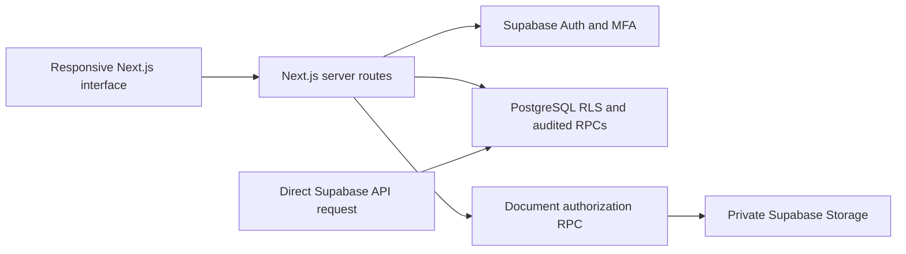

# Architecture and data protection

## Request path

Browser components never receive a service-role key or Auth refresh token. The Supabase SSR client stores sessions in HTTP-only, SameSite=Lax cookies; Secure is enabled in production. Next.js proxy refreshes the cookies, while pages and API handlers validate the user again. UI visibility uses the same permission names as the backend but is not a security boundary.

The data loader uses the caller's Supabase client, not the service-role client. All CentralHub tables enable row-level security. Ordinary clients have narrowly granted SELECT access and no direct INSERT/UPDATE/DELETE privileges. Mutations run through parameterized, scoped PostgreSQL functions with an empty search path. Their default EXECUTE permissions are revoked; only explicit client functions are exposed. Migrations change grants only on application-owned objects and preserve unrelated tables, functions, and default privileges. Unknown accounts, unassigned permissions, invalid sessions, and missing MFA deny access.

Sensitive personal fields, highly sensitive categories, compensation, and directory fields are physically separated. Private contact information, sensitive records, payslips, and performance reads use audited functions. Medical/disciplinary/bank/identity access is not implied by Owner, CFO, Technical Administrator, or a general HR role.

## Authentication and session lifecycle

- Supabase Auth handles password hashing, sign-in, email one-time tokens, refresh-token rotation, and TOTP MFA. Public sign-up is disabled and there is no application account-creation trigger from arbitrary Auth metadata.
- Password and recovery requests use a persistent PostgreSQL rate limiter keyed by an HMAC of the email and operation. The email is not stored in that limiter. It allows eight attempts per 15-minute window; Supabase also supplies its own provider/IP rate limits.
- Every application session references a real `auth.sessions` record. Its lifetime is capped at eight hours from the original Auth session creation. Refreshing a JWT or calling `register_session` cannot extend it.
- Every policy consults the current account status, grant records, session expiration/revocation, and JWT assurance level. Account suspension/deactivation revokes application sessions immediately. Reactivating an account does not revive an older Auth session.
- Any elevated grant requires AAL2. Privileged users must enroll and verify an authenticator before reaching the workspace. The verification endpoint allows only an otherwise valid signed-in account/session. Removing MFA elsewhere cannot bypass the database's AAL2 check.
- Login forms contain no role selector. Role/profile claims in client input or user metadata are never trusted.
- Reset/invitation emails carry Supabase's expiring, single-use token. The confirmation route consumes it with `verifyOtp`, then creates a separate random 256-bit, single-use, 15-minute application ticket. Only its SHA-256 digest is stored in PostgreSQL; the original is in an HTTP-only cookie.
- The ticket is bound to an Auth user and purpose. Only the server key can issue/consume it. A normal authenticated session cannot invoke password recovery by forging an API request. After a password reset/change, application sessions and Auth refresh sessions are revoked.
- POST routes require the configured application Origin. Production deployments must set the correct HTTPS `NEXT_PUBLIC_SITE_URL`.

## Approval consistency

Leave submission locks per employee and locks the selected annual balance. Overlap checking, weekday/holiday calculation, pending-day reservation, route assignment, notification, and audit entry occur in one transaction. Approval locks the request; a second decision is rejected. It consumes pending days and adds used days only for an approval. Cancelling a pending request releases reserved days. Employees cannot approve themselves, including when they also hold an HR or executive role.

Attendance corrections preserve the original and replacement timestamps in `attendance_history`. The original clock record is updated only after an authorized assigned reviewer approves. Payroll imports are all-or-nothing transactions, validate amounts, reject duplicate employee/period records, and start as unpublished drafts.

Reporting lines and approval routes are separate. Direct-report scope reads only explicitly stored immediate manager relationships. Team and department scope compare explicit IDs. A department's parent does not imply access to descendants. Reviewer assignments add only the work identity needed for assigned review context; they do not grant salary or private HR records.

## Private files

The `hris-private` bucket is private with a 10 MB object limit and a constrained MIME allowlist. No client storage policies grant access to its objects. Upload endpoints validate caller permissions, file sizes, declared MIME types, and PDF/PNG/JPEG signatures. Metadata uses generated object names rather than user-controlled storage paths.

Each download first calls an authorization/audit function using the caller's JWT. The server then streams the object with the server key, attachment disposition, `nosniff`, and `private, no-store`. Reusable public/signed download URLs are not created. Suspending an account or revoking a grant prevents the next download even if the user remembers its URL. Profile photos use a separate authorized directory lookup and generated employee-owned paths.

Only invitation operations, private Storage streaming, rate-limit/ticket handling, and trusted setup scripts need the server key. These paths validate the caller before privileged operations. The service key never appears in a client bundle, demo data, `.env.example`, or committed environment file.

## Audit and operational boundaries

Audit rows contain actor ID, action, resource type/ID, and time. They exclude record values, salaries, bank information, passwords, and tokens. Role/grant changes, lifecycle edits, approvals, private record access, exports, downloads, and password lifecycle changes are recorded. Ordinary users cannot insert, edit, or delete audit rows.

The source has no request-body logging. Hosting infrastructure must also redact token query parameters on `/auth/confirm`. Configure operational retention, backups, incident response, and access to Supabase's service credentials for your company. Supabase-managed transport/at-rest encryption does not replace organizational access controls.

The application targets a single company and modest initial data volume. Directory search is server-paginated. Other workspace modules load bounded authorized history windows; their limits are stated in the verification/setup notes. A future large-workforce release can add cursor pagination to each historical module without changing the authorization model.

## Development preview

The preview has a fixed fictional HR persona and cannot choose privileged roles at login. It exists only in a development Next.js process with Supabase unconfigured. Its records live in browser localStorage, while explicitly selected preview files use IndexedDB. Real Supabase data is never persisted to those preview stores. Production API routes always require live Auth and never fall back to demo data.
